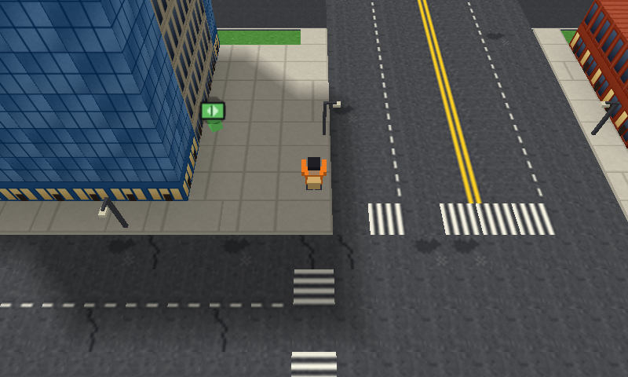
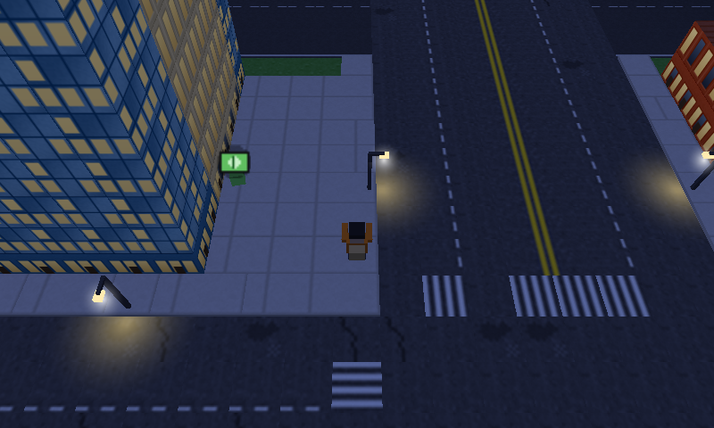
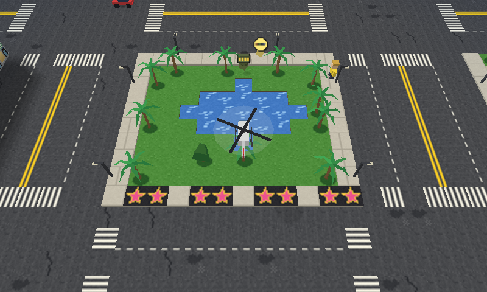
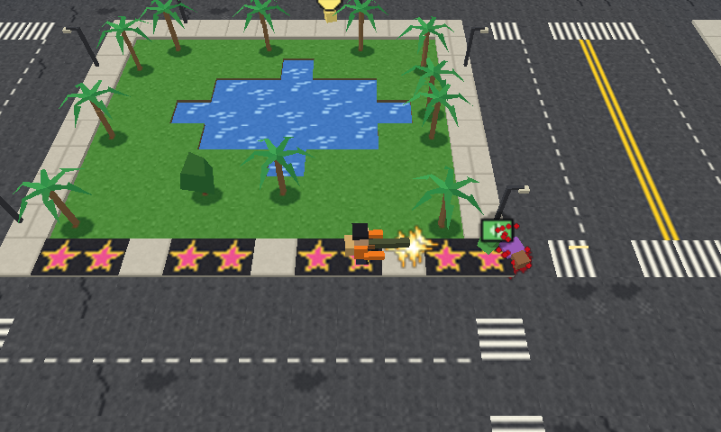
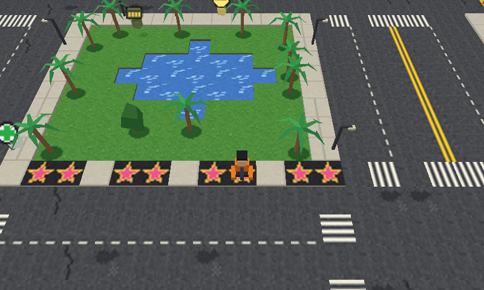
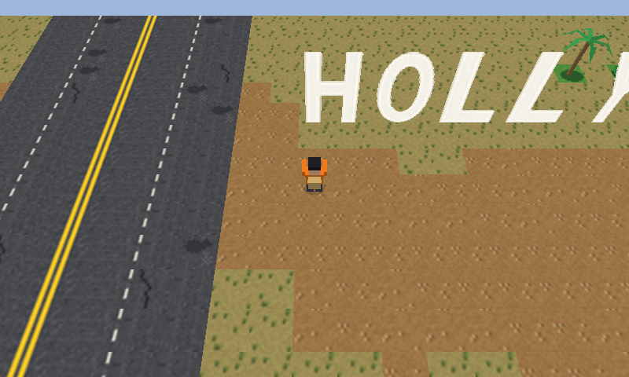

# 3ds-homebrew

Nintendo 3DS homebrew games written in C with [devkitPro](https://devkitpro.org/) (libctru + citro2d/citro3d). Each project also has a small PC-side harness for rendering preview frames and running logic tests without a console.

## Grand Theft Otto

| | |
| --- | --- |
|  |  |
|  |  |
|  |  |

*Frames from the PC preview renderer (`grand-theft-otto/host/preview3d.sh`), which rasterises the same triangles the 3DS draws. The top-screen HUD is not shown.*

## Projects

| Folder | What it is |
| --- | --- |
| `hello3ds/` | Minimal starter app: console output and touch input |
| `tuffyrun/` | Endless runner with landmarks, audio and an SD-card high score |
| `grand-theft-otto/` | Open-world crime sandbox with a real 3D city (extruded buildings, baked sun shadows, day/night cycle, stereoscopic 3D), a 256x256-tile LA, eight weapons, cars and helicopters. Pause + X switches to the classic top-down 2D view. Design notes in [`PLAN.md`](grand-theft-otto/PLAN.md) |

## Setup

Toolchain install (Debian/Ubuntu-style Linux):

```bash
bash setup.sh          # installs devkitPro + the 3ds-dev package (needs sudo)
source env.sh          # sets DEVKITPRO / DEVKITARM / PATH
```

`setup.sh` expects the devkitPro pacman `.deb` in `tools/`. That folder is git-ignored, so download `devkitpro-pacman.deb` from devkitPro's site into `tools/` first (see their [Getting Started](https://devkitpro.org/wiki/Getting_Started) page).

## Build

```bash
source env.sh
cd grand-theft-otto && make     # produces .3dsx, .cia, .elf and .smdh
```

Copy the `.3dsx` to `sdmc:/3ds/` and launch it from the Homebrew Launcher, or load the `.cia` with FBI, or run it in the [Citra](https://citra-emu.org/) emulator.

Build output (`build/`, `.elf`, `.cia`, `.3dsx`, `.smdh`) is git-ignored.

## PC preview and tests

`tuffyrun` and `grand-theft-otto` have a `host/` folder that compiles the game logic with `gcc` against a small graphics shim:

```bash
grand-theft-otto/host/preview.sh [outdir]   # renders sample frames to PNG (needs gcc and Pillow)
```

`simtest.c` in each `host/` folder runs headless simulation checks.

## Notes

- Game logic is kept separate from drawing so it can run on the PC.
- Sprites and textures are generated by Python scripts in each project's `assets/` folder.
